# awesome-jev
[English version →](README_EN.md)

    

**全网 JEV 玩法案例库 · 持续更新中** —— 收录来自 X / 博客 / 论坛 / 论文等全网的 Jev 实战用法，并精选 30 个开源项目，不只限 X 平台。

📊 68 条帖子 + 30 个开源项目 · 9 大应用场景 · 50 条 Jev 精选

## 目录

- [🧠 可作 Skill 使用](#skill-usage)
- [📦 安装](#installation)
- [Jev 是什么](#jev-是什么)
- [为什么有这个清单](#为什么有这个清单)
- [浏览器与电脑自动化](#浏览器与电脑自动化)
- [游戏与实时交互](#游戏与实时交互)
- [交易与金融](#交易与金融)
- [生态与热度](#生态与热度)
- [开发与工具](#开发与工具)
- [内容分类与SEO](#内容分类与seo)
- [教程与资源](#教程与资源)
- [模型路由与决策](#模型路由与决策)
- [上下文压缩](#上下文压缩)
- [⭐ 开源项目精选](#open-source-projects)
- [其他](#其他)

## 🧠 可作 Skill 使用

> 本仓库**不只是一个清单，更是一个可被模型 / Agent 直接加载的 JEV 技能包**——仓库根目录即 Skill 包，自带 `SKILL.md` 与 `references/index.json`（98 条案例数据：68 帖 + 30 项目）。

任何 Agent 都可以把本仓库当作「JEV 用法参考库」直接加载：**即便用户没有主动说想怎么用 Jev，Agent 也能依据这里的真实案例，主动推荐合适的玩法模式**，而不是干巴巴回一句"Jev 是个小模型"。

它的工作方式很简单：

1. Agent 读取根目录 `SKILL.md`，再加载 `references/index.json` 拿到 98 条案例（68 帖 + 30 项目）与 9 大场景索引；
2. 按用户意图跳到对应场景，优先挑出 ⭐ Jev 精选 + 高评分案例；
3. 结合 `images/` 里的原帖截图与原始 X 链接，为用户生成具体、可落地的玩法建议。

换句话说，这 98 条案例（68 帖 + 30 项目）既是给人看的收藏夹，也是可以直接喂给 Agent 的「Jev 玩法说明书」。

## 📦 安装

**方式一：复制给任意 Agent（推荐）** —— 把下面这段文字复制给豆包 / Claude / Codex 等任意 Agent，即可自动完成安装，无需手动敲命令：

> 帮我安装 awesome-jev 这个 Skill：
> 1. 从 GitHub 仓库 https://github.com/Ai-trainee/awesome-jev 克隆/下载到你的 skills 目录下，目录名保持 awesome-jev（例如 workspace/.user_skills/awesome-jev；如果你的环境用别的 skills 目录，就装到对应的那个）；
> 2. 确认克隆后的目录根目录有 SKILL.md 文件；
> 3. 加载并激活这个 Skill，然后告诉我它能做什么、装好后可以怎么用。

安装后 Agent 扫描到根目录 `SKILL.md` 即自动生效，会读取 `references/index.json`（98 条案例：68 帖 + 30 开源项目）+ `images/` 主动为你推荐 Jev 玩法，无需额外配置。

## Jev 是什么

Jev 是一个轻量、毫秒级执行模型，常与大模型配对，构成「大模型推理 + 小模型执行」的 Agent 架构：大模型负责规划与推理，Jev 负责高频、廉价、确定性的决策与动作。本仓库收集社区中围绕 Jev 的真实玩法案例。

## 为什么有这个清单

很多人不知道 Jev 到底能怎么用。这里用 68 个帖子案例 + 30 个开源项目，展示浏览器自动化、游戏、交易、模型路由等典型玩法。当用户不主动说明场景时，也可据此主动推荐合适的使用模式。仓库中的截图仅作索引之用，版权归原作者所有。

## 浏览器与电脑自动化

- **Breaking: Browser Use + Jev = 超快速浏览器代理！7秒完成成本仅$0.0039，开源** — Gregor Zunic (gregpr07) · Jev 评分 84 · 成本与性能 · ⭐ Jev 精选
  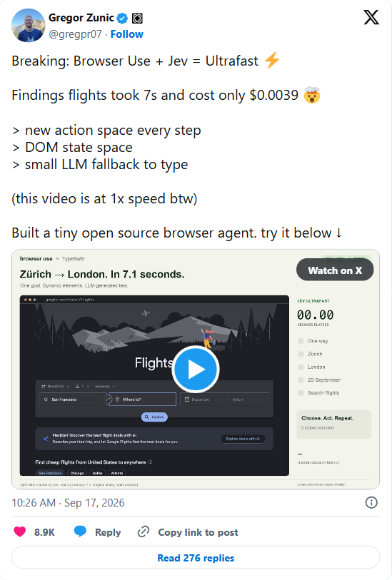
  [🔗 在 X 上查看](https://x.com/gregpr07/status/2100411066966749359)

- **Jev + Computer use = 比任何LLM快100倍，眨个眼就错过** — sav (savboj) · Jev 评分 56 · 成本与性能 · ⭐ Jev 精选
  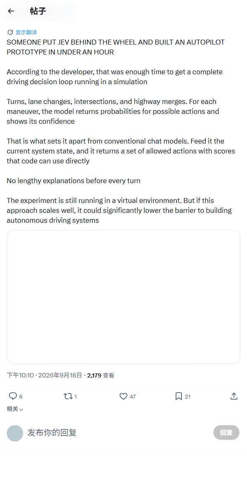
  [🔗 在 X 上查看](https://x.com/savboj/status/2100545295201288678)

- **agent-browser + Jev 玩 Wiki Race：浏览器自动化合理用例（182赞）** — joogie (princecaarlo) · Jev 评分 48 · 工具与产品
  
  [🔗 在 X 上查看](https://x.com/princecaarlo/status/2100313645116952701)

- **Jev 做 Chrome 扩展：实时检测 YouTube 赞助片段并跳过，每视频$0.005（453赞）** — Tony Dinh (tdinh_me) · Jev 评分 77 · 工具与产品 · ⭐ Jev 精选
  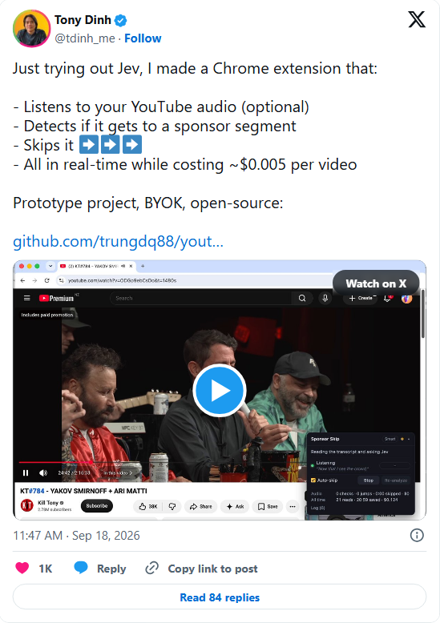
  [🔗 在 X 上查看](https://x.com/tdinh_me/status/2100793777103466615)

- **Browser Use 接 JEV 速度吓人：网页操作本质是离散多选题，不需要 AI 写诗（1190赞）** — 梭哈.AI (SUOHA_AI) · Jev 评分 80 · 架构与方法 · ⭐ Jev 精选
  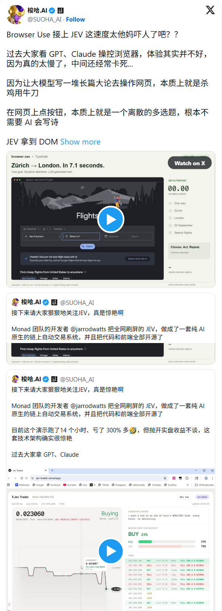
  [🔗 在 X 上查看](https://x.com/SUOHA_AI/status/2100628846240264348)

- **Web Agent 航空券搜索 7 秒完成，成本仅 $0.0039：从慢且贵到快且便宜（28赞）** — KANA｜東京AI映像 (KanaWorks_AI) · Jev 评分 43 · 成本与性能
  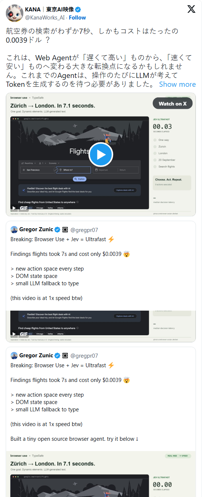
  [🔗 在 X 上查看](https://x.com/KanaWorks_AI/status/2100783766193246394)

- **有人用 Jev 做了自动驾驶原型：一小时内完成完整驾驶决策循环（43赞）** — Mikadzyki (Mikadzyki_NFT) · Jev 评分 58 · 工具与产品 · ⭐ Jev 精选
  
  [🔗 在 X 上查看](https://x.com/Mikadzyki_NFT/status/2100950578113232992)

- **SAM 3.1 × Jev：完全自立型 ComputerUse、高速人脸认证（914赞）** — StudioYebisu (studio_yebisu) · Jev 评分 80 · 架构与方法 · ⭐ Jev 精选
  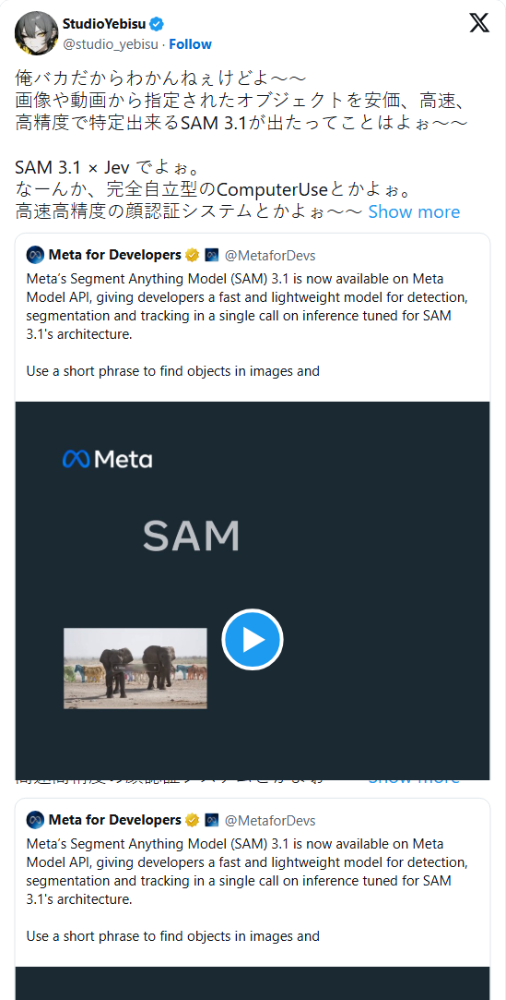
  [🔗 在 X 上查看](https://x.com/studio_yebisu/status/2101003307200430126)

- **Jev 语音操控电脑比键鼠还快：Alan Daitch 实测（102赞）** — @AlanDaitch · Jev 评分 57 · 成本与性能 · ⭐ Jev 精选
  
  [🔗 在 X 上查看](https://x.com/AlanDaitch/status/2101090570110169547)

## 游戏与实时交互

- **Jev + Astra 玩吃豆人：Astra 制定策略，Jev 毫秒级执行，大模型+小模型协作架构** — Dan McAteer (daniel_mac8) · Jev 评分 61 · 架构与方法 · ⭐ Jev 精选
  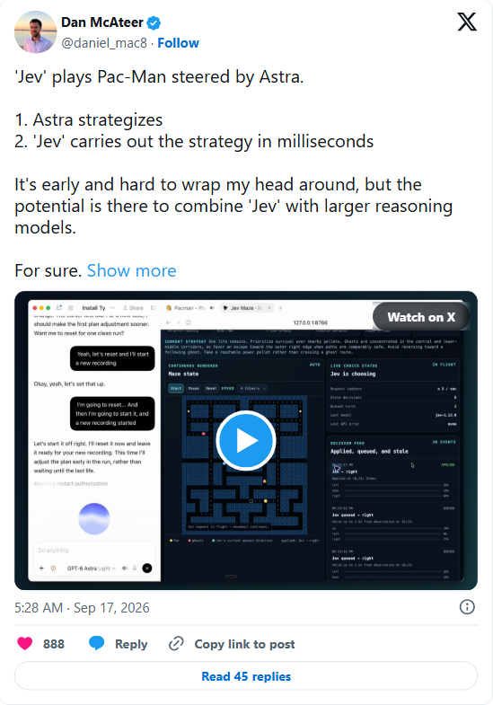
  [🔗 在 X 上查看](https://x.com/daniel_mac8/status/2100335929273524541)

- **Jev V13 vs Fable 5.1 vs GPT-6 Astra 下棋：Jev 不是LLM，只做决策（2098赞）** — AI/ML API (aimlapi) · Jev 评分 86 · 架构与方法 · ⭐ Jev 精选
  
  [🔗 在 X 上查看](https://x.com/aimlapi/status/2100372930282573876)

- **陈成让 Jev 玩贪吃蛇：200个请求 $0.02，1美元能走一万步（246赞）** — 陈成 (chenchengpro) · Jev 评分 47 · 成本与性能
  
  [🔗 在 X 上查看](https://x.com/chenchengpro/status/2100516953496670430)

- **Jev 玩宝可梦：$1.21 花掉 8000+ 决策，已拿第一个道馆徽章** — Boyd (0xBOYD) · Jev 评分 72 · 成本与性能 · ⭐ Jev 精选
  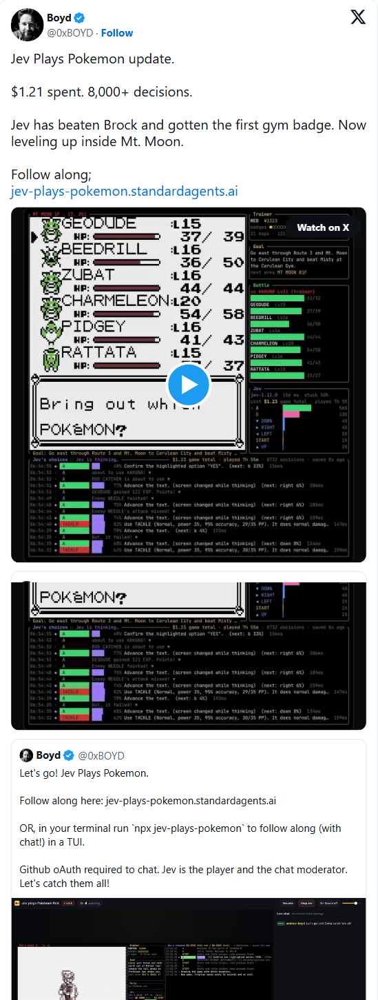
  [🔗 在 X 上查看](https://x.com/0xBOYD/status/2100539883836018697)

- **Jev 玩马里奥：单次决策延迟229ms，1-1都没过，实时性不够（56赞）** — 陈成 (chenchengpro) · Jev 评分 42 · 成本与性能
  
  [🔗 在 X 上查看](https://x.com/chenchengpro/status/2100552073150665056)

- **Jev 打杀戮尖塔2：行动思考只需 0.7 秒，超人类游戏速度（977赞）** — paulwei (coolish) · Jev 评分 64 · 成本与性能 · ⭐ Jev 精选
  
  [🔗 在 X 上查看](https://x.com/coolish/status/2100570517954838897)

## 交易与金融

- **JEV 被做成纯 AI 原生链上自动交易系统，代码前端全开源（14小时亏300%但架构惊艳）** — 梭哈.AI (SUOHA_AI) · Jev 评分 78 · 工具与产品 · ⭐ Jev 精选
  
  [🔗 在 X 上查看](https://x.com/SUOHA_AI/status/2100619720772694036)

- **用 Jev 造交易机器人：每300ms区块判断买卖，执行真实交易（4392赞）** — Jarrod Watts (jarrodwatts) · Jev 评分 89 · 工具与产品 · ⭐ Jev 精选
  
  [🔗 在 X 上查看](https://x.com/jarrodwatts/status/2100356151468585346)

- **用 Jev 自动化技术分析：加密和股票市场预测（417赞）** — Brendan Playford (BrendanPlayford) · Jev 评分 61 · 架构与方法 · ⭐ Jev 精选
  
  [🔗 在 X 上查看](https://x.com/BrendanPlayford/status/2100485748533440990)

- **Jev 交易实测：像人类一样 ATH 买入恐慌卖出，'AGI 确认'（198赞）** — Rafal Wilinski (rafalwilinski) · Jev 评分 38 · 生态与热度
  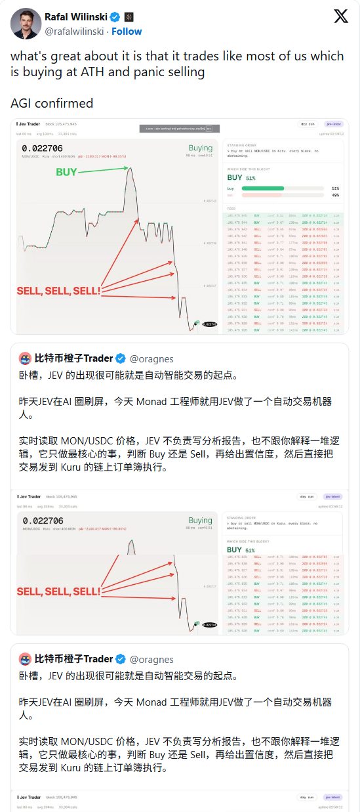
  [🔗 在 X 上查看](https://x.com/rafalwilinski/status/2100516118586642476)

## 生态与热度

- **JEV 电车难题：牺牲人类救机器人，263赞热议 AI 伦理** — Max Rovensky (MaxRovensky) · Jev 评分 38 · 生态与热度
  
  [🔗 在 X 上查看](https://x.com/MaxRovensky/status/2100706874173575199)

- **硅谷十年前就预言了 Jev（3901赞爆款）** — Justin Schroeder (jpschroeder) · Jev 评分 44 · 生态与热度
  
  [🔗 在 X 上查看](https://x.com/jpschroeder/status/2100230381588951209)

- **We don't deserve Jev：100毫秒回答任何问题基本免费，Astra/Fable 让我们不知感恩（131赞）** — Rob Hallam (robj3d3) · Jev 评分 26 · 成本与性能
  
  [🔗 在 X 上查看](https://x.com/robj3d3/status/2100876506549645608)

- **Jev 的局限分析：零样本概率分布不适用于市场语境，生年收入估算也偏差大（83赞）** — 抹茶もなか (GianMattya) · Jev 评分 57 · 架构与方法
  
  [🔗 在 X 上查看](https://x.com/GianMattya/status/2100878864855748668)

- **Vercel CEO：Jev Generative UI 已经在外部实现了（1928赞）** — Guillermo Rauch (rauchg) · Jev 评分 59 · 工具与产品 · ⭐ Jev 精选
  
  [🔗 在 X 上查看](https://x.com/rauchg/status/2101032024635249069)

- **Vercel CEO：Jev 采用数据令人震惊——每个人都在采用（243赞）** — Guillermo Rauch (rauchg) · Jev 评分 58 · 生态与热度 · ⭐ Jev 精选
  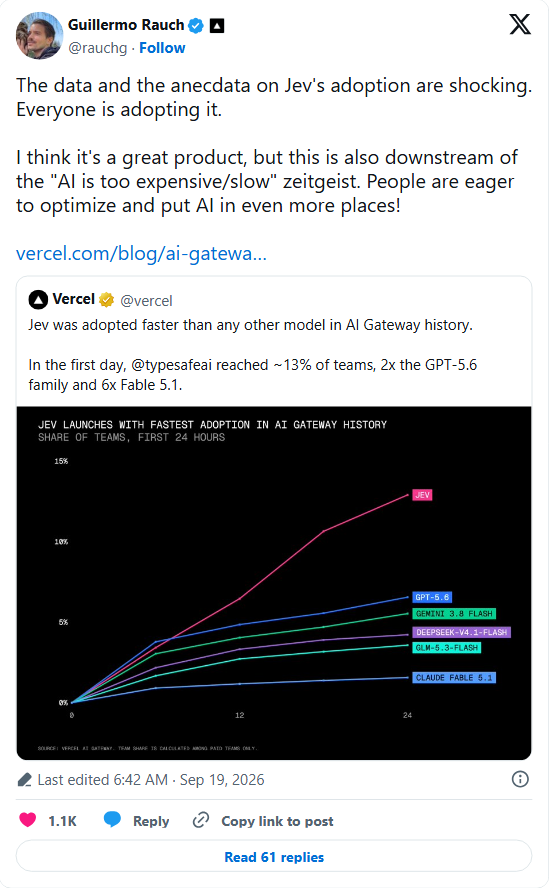
  [🔗 在 X 上查看](https://x.com/rauchg/status/2101079472732848510)

- **Jev 现在感觉像 ChatGPT 时刻（12赞）** — Maz (0xmaz_) · Jev 评分 9 · 生态与热度
  
  [🔗 在 X 上查看](https://x.com/0xmaz_/status/2101030854269231389)

- **睡一觉起来 Jev 系 GitHub 仓库暴增（340赞）** — StudioYebisu (studio_yebisu) · Jev 评分 66 · 生态与热度 · ⭐ Jev 精选
  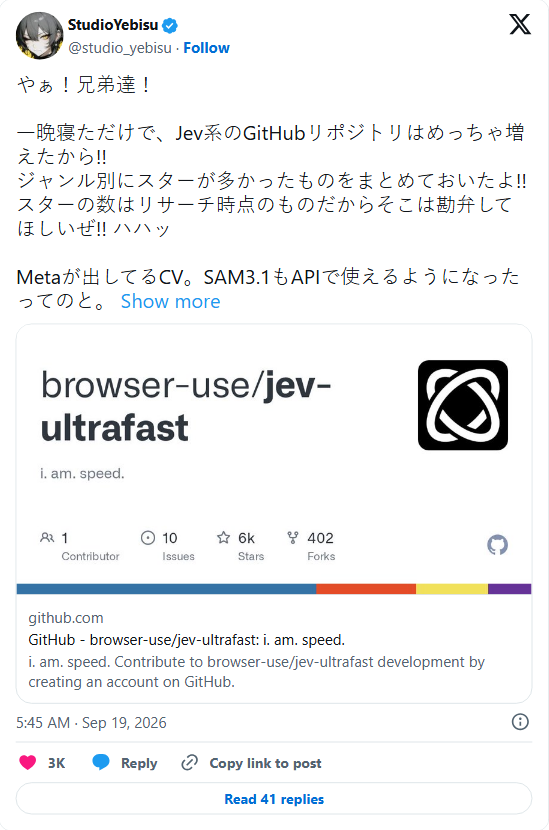
  [🔗 在 X 上查看](https://x.com/studio_yebisu/status/2101065176069886152)

## 开发与工具

- **OpenJev 开源：JEV 模型 GitHub 开源实现，全网围观（1466赞）** — 𝑺𝒉𝒊𝒃𝒂 (4ba_ba_baba) · Jev 评分 55 · 工具与产品 · ⭐ Jev 精选
  
  [🔗 在 X 上查看](https://x.com/4ba_ba_baba/status/2100476048957931642)

- **用 Jev 从零搭了个 LLM：每个字符 29 个是/否问题（873赞）** — vogel (ryanvogel) · Jev 评分 77 · 架构与方法 · ⭐ Jev 精选
  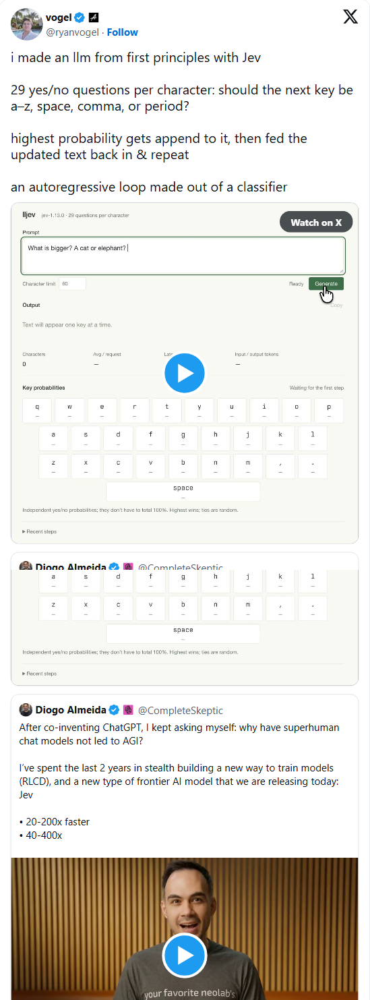
  [🔗 在 X 上查看](https://x.com/ryanvogel/status/2100218045549412499)

- **Jev 即时 AI 建议：每次编辑单元格20+智能检查，无需LLM（174赞）** — Chris Nicholas (ctnicholasdev) · Jev 评分 66 · 架构与方法 · ⭐ Jev 精选
  
  [🔗 在 X 上查看](https://x.com/ctnicholasdev/status/2100611346203353110)

- **开源 jev-job-hunter：给 Jev 一个官网，它自动找招聘页打分（75赞）** — @hqmank · Jev 评分 51 · 工具与产品 · ⭐ Jev 精选
  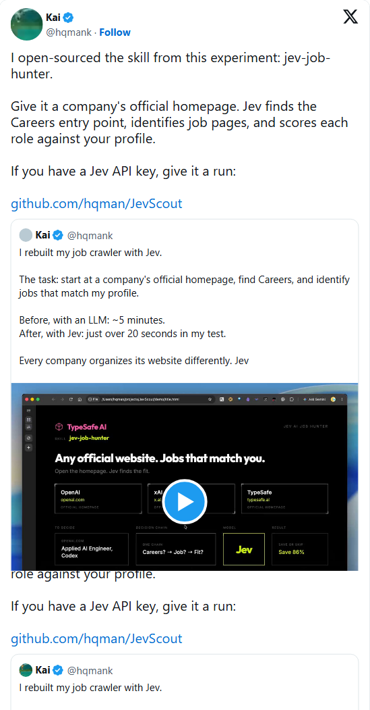
  [🔗 在 X 上查看](https://x.com/hqmank/status/2100938653979508826)

## 内容分类与SEO

- **Jev + Grok Bot + X API：从1000条帖子里选出最有价值的AI Agent建议** — Dan McAteer (daniel_mac8) · Jev 评分 66 · 架构与方法 · ⭐ Jev 精选
  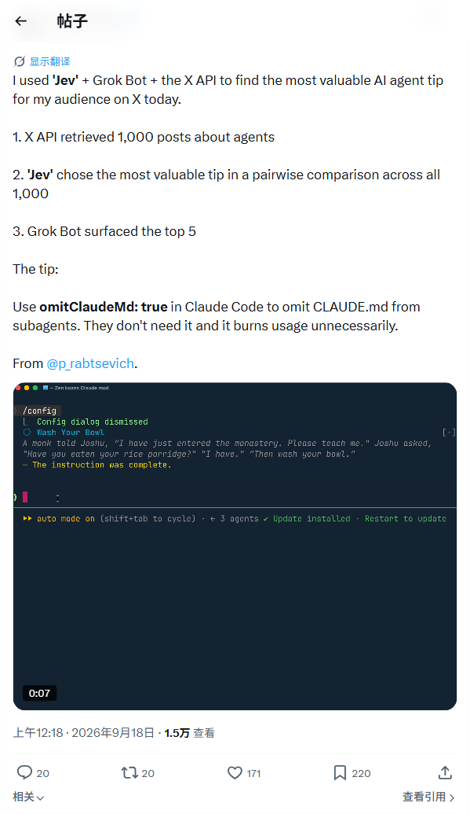
  [🔗 在 X 上查看](https://x.com/daniel_mac8/status/2100620339097026633)

- **DuckDB 扩展：Jev 给任意 CSV/Parquet 打标签，1千行约10秒（1347赞）** — Hamilton Ulmer (hamiltonulmer) · Jev 评分 74 · 工具与产品 · ⭐ Jev 精选
  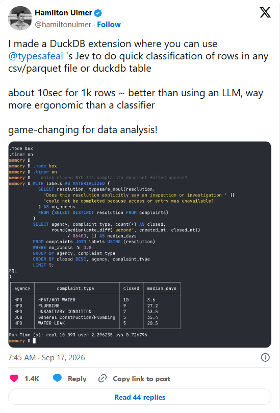
  [🔗 在 X 上查看](https://x.com/hamiltonulmer/status/2100370557405667768)

- **fx auto 安全分类器用 Jev 替代 GPT-5.6 Luna：快5-18倍更准（608赞）** — Pranit (fazxes) · Jev 评分 78 · 成本与性能 · ⭐ Jev 精选
  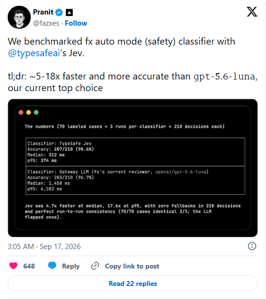
  [🔗 在 X 上查看](https://x.com/fazxes/status/2100300097695232164)

- **Jev 语义查询 cookbook：从海量信息中智能提取信号（506赞）** — Nathan LeClaire (dotpem) · Jev 评分 43 · 架构与方法
  
  [🔗 在 X 上查看](https://x.com/dotpem/status/2100389272004198844)

- **Jev 热度非常高：人民日报新闻分类实测（43赞）** — 李不凯正在研究 (libukai) · Jev 评分 47 · 生态与热度
  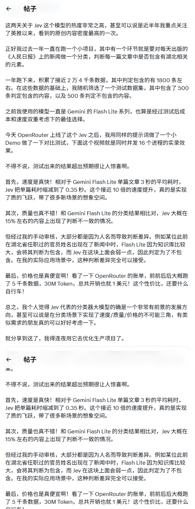
  [🔗 在 X 上查看](https://x.com/libukai/status/2100984923926728920)

- **Jev vs DeepSeek 实测：28 秒狂刷 428 条新闻为 15 个品牌匹配热点（564赞）** — 梭哈.AI (SUOHA_AI) · Jev 评分 75 · 内容与营销 · ⭐ Jev 精选
  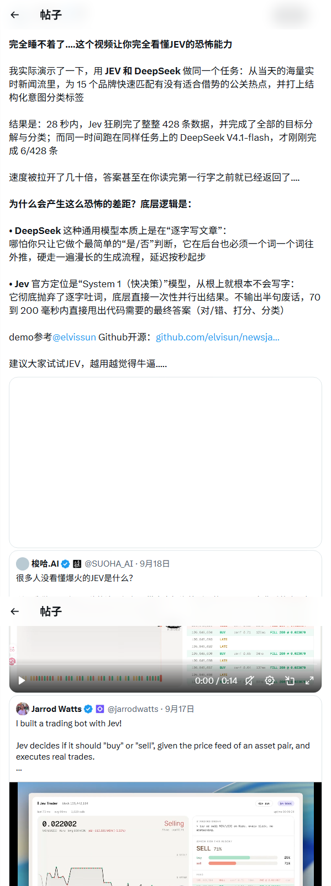
  [🔗 在 X 上查看](https://x.com/SUOHA_AI/status/2101000339948282090)

- **Jev 把 SEO/GEO 修复成本砍 90%：原来 /单，现在几乎免费** — @irabukht · Jev 评分 80 · 内容与营销 · ⭐ Jev 精选
  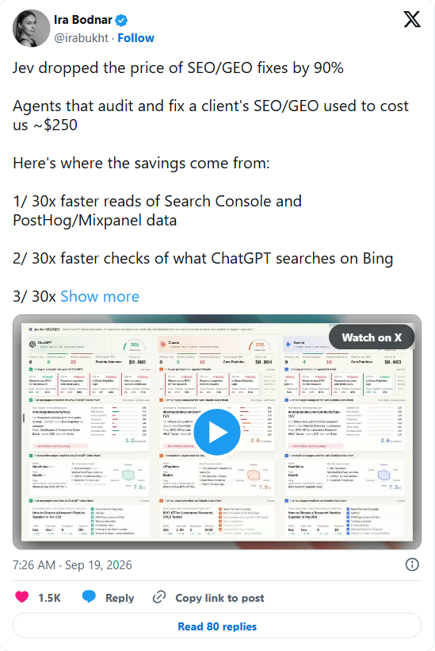
  [🔗 在 X 上查看](https://x.com/irabukht/status/2101090579127951694)

- **把竞争对手广告库喂给 Jev：19 秒分类 1891 个广告** — @liambraus · Jev 评分 74 · 内容与营销 · ⭐ Jev 精选
  
  [🔗 在 X 上查看](https://x.com/liambraus/status/2100954699255947277)

## 教程与资源

- **Matija Sosic 45秒视频讲清 Jev 核心：想法美得简单（7799赞）** — Matija Sosic (MatijaSosic) · Jev 评分 82 · 架构与方法 · ⭐ Jev 精选
  
  [🔗 在 X 上查看](https://x.com/MatijaSosic/status/2100190746389135772)

- **Jev 深度教程：它是什么、怎么用（716赞）** — Flavio Copes (flaviocopes) · Jev 评分 75 · 生态与热度 · ⭐ Jev 精选
  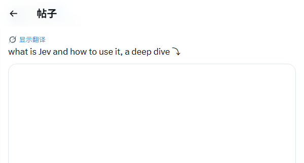
  [🔗 在 X 上查看](https://x.com/flaviocopes/status/2100695543995347188)

- **Jev 模型实用指南：Codex 写 waitlist 申请通过，Jev 做分类器，整理10个仓库** — 飞翔的企鹅x (BystAnd3rs) · Jev 评分 72 · 工具与产品 · ⭐ Jev 精选
  
  [🔗 在 X 上查看](https://x.com/BystAnd3rs/status/2100769446457647532)

- **Jev 学习资源聚合中心上线：官方+社区+可运行项目一站式** — YouWare (YouWareAI) · Jev 评分 43 · 工具与产品
  
  [🔗 在 X 上查看](https://x.com/YouWareAI/status/2100655600803966986)

- **Jev 的 9 个使用场景（System 1 模型）：reranking/工具剪枝/模型路由/查询路由（117赞）** — Amit Shekhar (amitiitbhu) · Jev 评分 69 · 架构与方法 · ⭐ Jev 精选
  
  [🔗 在 X 上查看](https://x.com/amitiitbhu/status/2100839449576030414)

- **Jev 45秒视频解析：不止 game/trade，速度+文本理解+排序衍生无限（105赞）** — Jason Zhu (GoSailGlobal) · Jev 评分 52 · 架构与方法 · ⭐ Jev 精选
  
  [🔗 在 X 上查看](https://x.com/GoSailGlobal/status/2100620755155181835)

- **刚拿到 Jev 权限：分享让 Codex 和 Claude 找工作流决策点的 prompt（80赞）** — Avid (Av1dlive) · Jev 评分 68 · 架构与方法 · ⭐ Jev 精选
  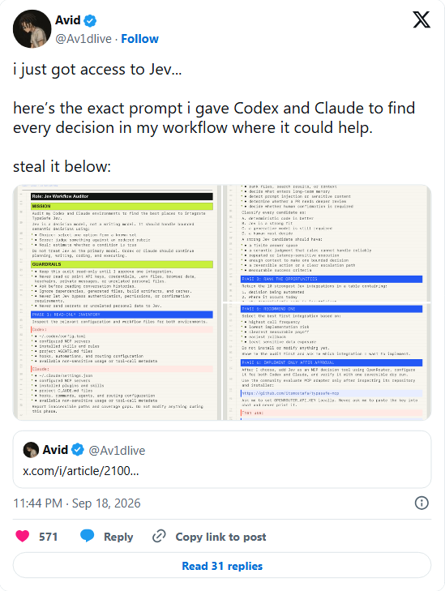
  [🔗 在 X 上查看](https://x.com/Av1dlive/status/2100974220759196026)

- **Jev 来了：最清楚的解释，它是什么，解锁什么新业务（462赞）** — GREG ISENBERG (gregisenberg) · Jev 评分 86 · 工具与产品 · ⭐ Jev 精选
  
  [🔗 在 X 上查看](https://x.com/gregisenberg/status/2101018750916948237)

- **LangChain CEO：Jev 不是生成文本，是做简单受限输出——构建 harness 时非常有用** — Harrison Chase (hwchase17) · Jev 评分 69 · 架构与方法 · ⭐ Jev 精选
  > ⚠️ 截图暂缺：原推文已被删除或设为私密，无法访问。
  [🔗 在 X 上查看](https://x.com/hwchase17/status/2100773130041950579)

## 模型路由与决策

- **创始人回复'私有评测+校准置信度'：去吧自动化！（116赞）** — Diogo Almeida (CompleteSkeptic) · Jev 评分 41 · 生态与热度
  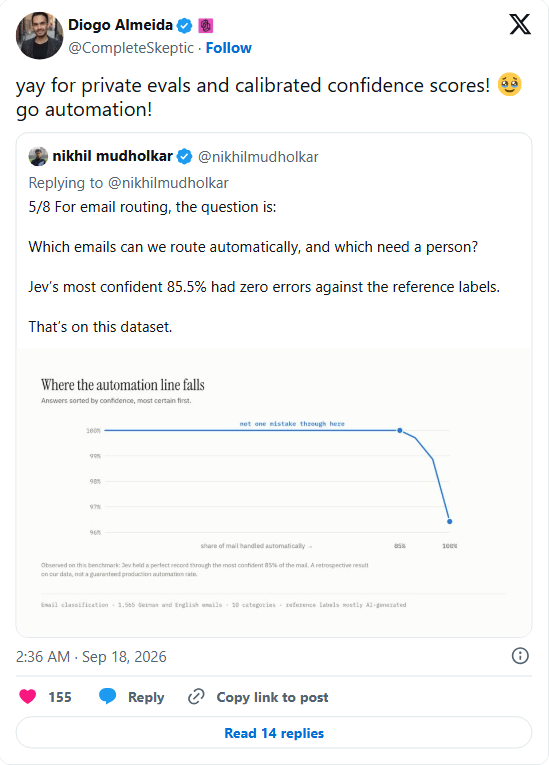
  [🔗 在 X 上查看](https://x.com/CompleteSkeptic/status/2100655158992719907)

- **Jev 做 UPSC 公务员考试：GS-1 考卷 72.7%（超过1-2%考生）** — YDSE (NeutronPrawn) · Jev 评分 59 · 工具与产品
  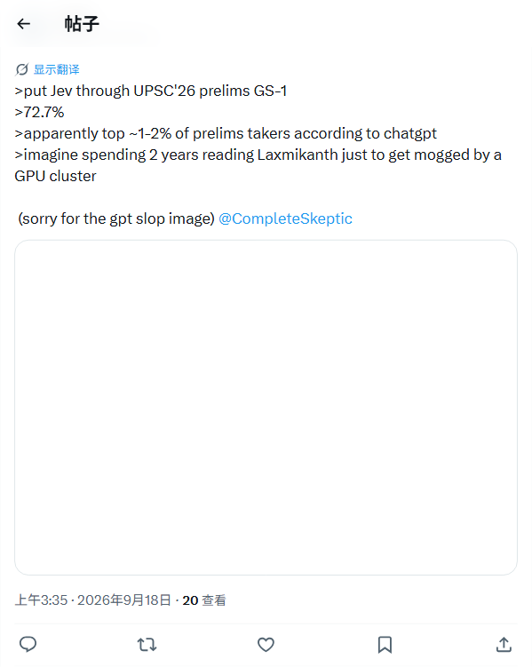
  [🔗 在 X 上查看](https://x.com/NeutronPrawn/status/2100670087128846603)

- **把 Agent 工具调用推理换成 Jev：成本大幅节省，效果接近 Fable/Astra/Opus（1212赞）** — Vini Lana (oviniciuslana) · Jev 评分 92 · 成本与性能 · ⭐ Jev 精选
  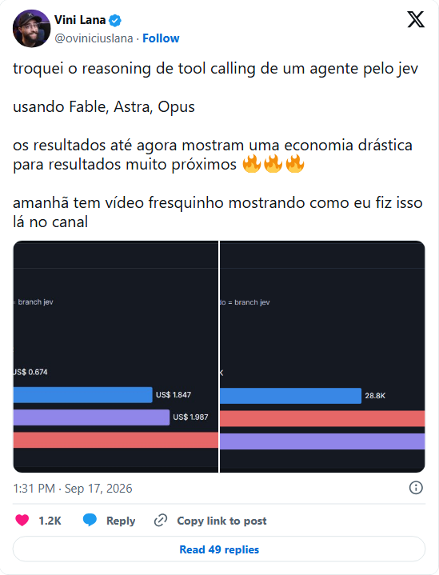
  [🔗 在 X 上查看](https://x.com/oviniciuslana/status/2100457622407168509)

- **Jev 判断特化 AI 实测：输入$0.042/1M tokens，输出无限免费（852赞）** — あきらパパ (akira_papa_IT) · Jev 评分 72 · 成本与性能 · ⭐ Jev 精选
  
  [🔗 在 X 上查看](https://x.com/akira_papa_IT/status/2100590065357639971)

- **Jev 作为模型路由器：用 Claude/Codex + Vercel eve 单提示词构建（166赞）** — Agent Native (agentnative_) · Jev 评分 67 · 架构与方法 · ⭐ Jev 精选
  
  [🔗 在 X 上查看](https://x.com/agentnative_/status/2100624941326500122)

- **Jev 让 agents 快10倍便宜10倍：模型路由+computer use+自动优化的3个用法（486赞）** — david fant (da_fant) · Jev 评分 75 · 成本与性能 · ⭐ Jev 精选
  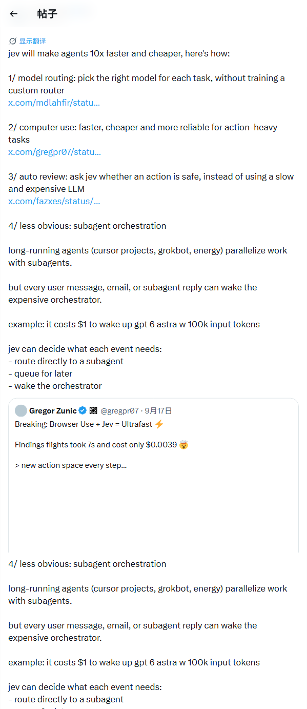
  [🔗 在 X 上查看](https://x.com/da_fant/status/2100659471257366766)

- **Jev 的 function calling 不需要按 Enter：理解意图提前执行（276赞）** — Yoshiki Miura (miiura) · Jev 评分 83 · 工具与产品 · ⭐ Jev 精选
  
  [🔗 在 X 上查看](https://x.com/miiura/status/2100615772053877164)

- **Jev 会抢走 LLM 的'脏活'：OpenRouter 已上 beta，不生成文本只判断（24赞）** — sleepy.md (sleepy0x13) · Jev 评分 59 · 工具与产品
  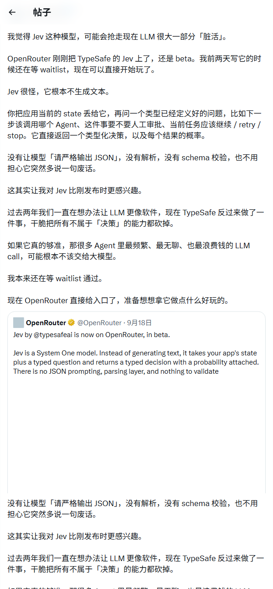
  [🔗 在 X 上查看](https://x.com/sleepy0x13/status/2100753996684403175)

- **新 Jev 模型：检查 AI 工作并在软件内决策，$0.042/百万输入 token（116赞）** — Shann³ (shannholmberg) · Jev 评分 76 · 成本与性能 · ⭐ Jev 精选
  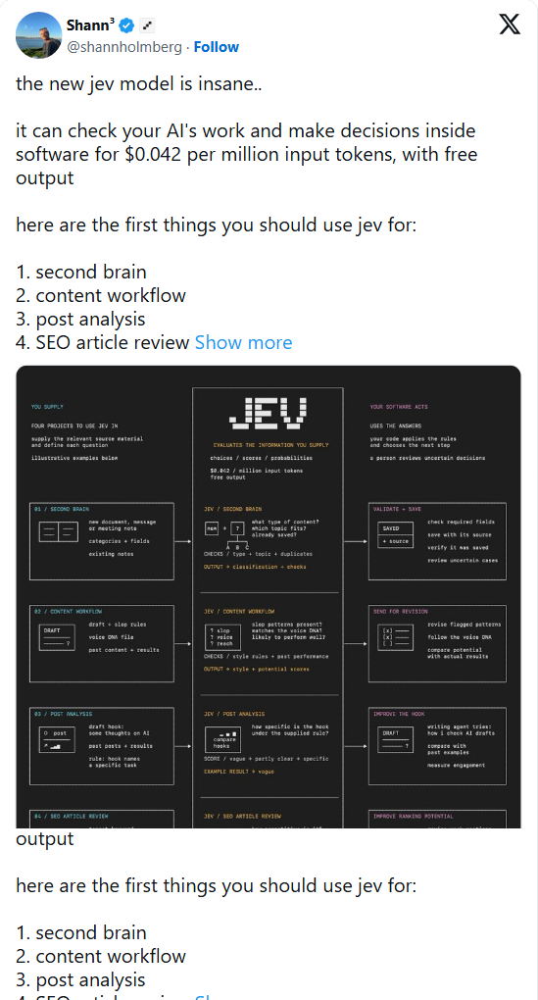
  [🔗 在 X 上查看](https://x.com/shannholmberg/status/2100979911825789393)

- **Jev 太火了：给 Claude Code 和 Codex 加 AI 裁判，OpenRouter 体验（61赞）** — 知识猫AI实验室 (GeekCatX) · Jev 评分 68 · 生态与热度 · ⭐ Jev 精选
  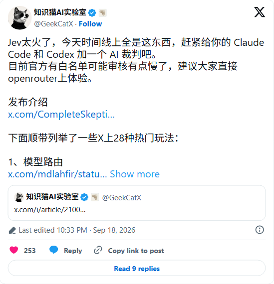
  [🔗 在 X 上查看](https://x.com/GeekCatX/status/2100956459580395585)

- **OpenRouter 官方解释 Jev：决策模型，比 LLM 便宜 10 倍快 10 倍（610赞）** — OpenRouter (OpenRouter) · Jev 评分 86 · 成本与性能 · ⭐ Jev 精选
  
  [🔗 在 X 上查看](https://x.com/OpenRouter/status/2101061688338575739)

- **Jev 实战：跳过聊天直接输出带置信度的结构化决策，快 193 倍便宜 445 倍** — @KKaWSB · Jev 评分 86 · 成本与性能 · ⭐ Jev 精选
  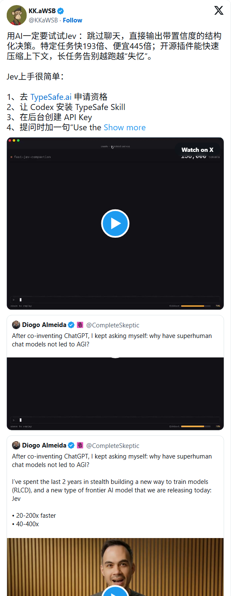
  [🔗 在 X 上查看](https://x.com/KKaWSB/status/2101043826714661033)

- **Jev 在 Vercel AI Gateway 免费到 9/25，适合测分类/评分/路由** — @HtWavever · Jev 评分 56 · 工具与产品 · ⭐ Jev 精选
  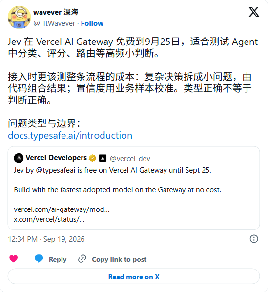
  [🔗 在 X 上查看](https://x.com/HtWavever/status/2101168084652622062)

- **Jev 用法：主 agent 自动搜 benchmark，按 pass rate/成本/时长路由模型** — @goon_nguyen · Jev 评分 66 · 架构与方法 · ⭐ Jev 精选
  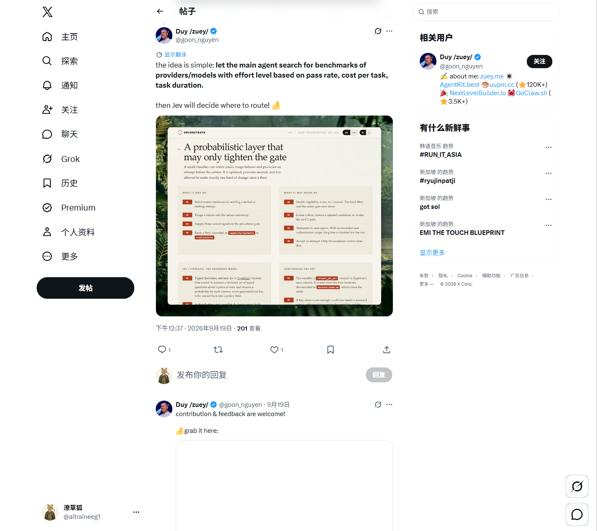
  [🔗 在 X 上查看](https://x.com/goon_nguyen/status/2101168725458354331)

## 上下文压缩

- **Jev 配套 Claude Code 插件 fast-jev-compaction：清理工具历史不摘要上下文（244赞）** — 松丸 彗吾 (k_matsumaru) · Jev 评分 64 · 工具与产品 · ⭐ Jev 精选
  
  [🔗 在 X 上查看](https://x.com/k_matsumaru/status/2100767258415157493)

- **Jev 最佳用例是记忆：并行决定 recall/store/merge/remove/relevance（435赞）** — Ant (anthdm) · Jev 评分 70 · 架构与方法 · ⭐ Jev 精选
  
  [🔗 在 X 上查看](https://x.com/anthdm/status/2100489448576131433)

- **JEV 联合创始人亲自转发：Claude Code 上下文卡顿插件开源（1560赞）** — 梭哈.AI (SUOHA_AI) · Jev 评分 83 · 工具与产品 · ⭐ Jev 精选
  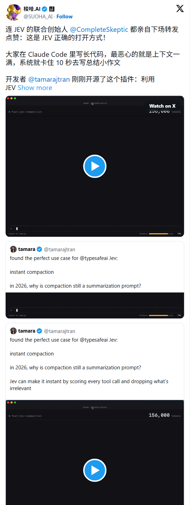
  [🔗 在 X 上查看](https://x.com/SUOHA_AI/status/2100780634734002230)

- **Jev 让 Claude Code/Codex 上下文用量减少 50%：代理问 Jev 哪些历史还需要（121赞）** — Pedro Nauck (pedronauck) · Jev 评分 70 · 成本与性能 · ⭐ Jev 精选
  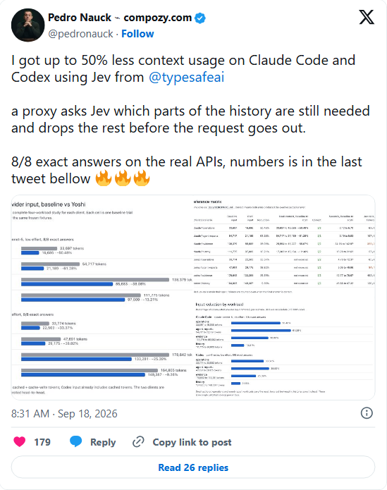
  [🔗 在 X 上查看](https://x.com/pedronauck/status/2100744500876320868)

- **被 Claude Fable 5.1 限制困扰的人：用 Jev 大幅改善（198赞）** — Claude code研究ラボ (claudecode84) · Jev 评分 46 · 工具与产品
  
  [🔗 在 X 上查看](https://x.com/claudecode84/status/2100810733076590784)

## ⭐ 开源项目精选

以下 30 个开源项目精选自社区 Jev 生态目录，经 Jev 独立评分筛选，覆盖工具、路由、浏览器、交易、游戏等场景。点击项目名跳转 GitHub。

- **[jev-review (devagrawal09)](https://github.com/devagrawal09/jev-review)** — ★366 · TypeScript · Jev 评分 55 · 工具与产品 · ⭐ Jev 精选 — 基于 TypeSafe Jev 的分阶段代码审查工作流 + 本地看板。
- **[jevbench](https://github.com/fstandhartinger/jevbench)** — ★67 · Python · Jev 评分 55 · 成本与性能 · ⭐ Jev 精选 — JevBench v1 —— Jev 类类型化决策模型的基准测试：智能、廉价、快速、可靠、开放。
- **[kev](https://github.com/jaredpalmer/kev)** — ★1558 · Python · Jev 评分 54 · 工具与产品 · ⭐ Jev 精选 — 基于 Qwen 的可训练小型 Jev 类决策模型家族，含类型化原语、数据集、评估工具与本地推理。
- **[NanoJev](https://github.com/TianyuCodings/NanoJev)** — ★1074 · Python · Jev 评分 52 · 成本与性能 · ⭐ Jev 精选 — 开源 0.6B Jev 复刻版：并行决策、完整概率分布、训练管线、权重、数据集与在线演示。
- **[jev-mcp (jkudish)](https://github.com/jkudish/jev-mcp)** — ★121 · TypeScript · Jev 评分 52 · 工具与产品 — TypeSafe Jev 模型的 MCP 概念验证实现。
- **[fast-jev-compaction](https://github.com/tamaratran/fast-jev-compaction)** — ★4427 · TypeScript · Jev 评分 51 · 工具与产品 — Claude Code 插件：用 Jev 决策替代压缩摘要——一次快速请求内为每次工具调用与结果打分，过时内容被丢弃或截断，保留内容逐字不动。
- **[open-jev (daseinlabs)](https://github.com/daseinlabs/open-jev)** — ★56 · Python · Jev 评分 51 · 成本与性能 — 受 jevlike 启发，通过 MLX 在 Apple 芯片上用本地 Gemma 3 4B 做单遍选项评分，附带 Doom 演示。
- **[hermes-jev-skills](https://github.com/kerpopule/hermes-jev-skills)** — ★345 · Python · Jev 评分 50 · 工具与产品 · ⭐ Jev 精选 — Hermes 插件与技能套件：用 Jev 做模型路由、技能选择、记忆过滤、上下文压缩与 GUI 操作。
- **[jev-review (NiazMorshed2007)](https://github.com/NiazMorshed2007/jev-review)** — ★171 · TypeScript · Jev 评分 50 · 工具与产品 · ⭐ Jev 精选 — 由 Jev 驱动的本地优先 MCP 插件，供 AI 编程代理做持续软件质量审查。
- **[jev-browser-use](https://github.com/wy-coliney/jev-browser-use)** — ★206 · JavaScript · Jev 评分 50 · 工具与产品 — 浏览器操作快 5–10 倍：Jev 负责点击，Codex 负责思考与验证（EZCollegeApp 出品）。
- **[jev-search](https://github.com/superagents-lab/jev-search)** — ★244 · TypeScript · Jev 评分 49 · 工具与产品 — 用 TypeSafe Jev 搜索网页：信源选择、查询理解与相关性排序（基于 Search1API）。
- **[jevlike](https://github.com/vinnylarouge/jevlike)** — ★1008 · Python · Jev 评分 47 · 成本与性能 · ⭐ Jev 精选 — 训练一个小模型，在变化的文本选项列表中做选择，单遍输出每个选项的概率；含 Doom、国际象棋与 Wikispeedia 演示。
- **[jeff](https://github.com/logan-markewich/jeff)** — ★189 · Python · Jev 评分 47 · 工具与产品 · ⭐ Jev 精选 — 自托管的 Jev 兼容 System One 服务器，基于 GLiNER 系列模型，支持批处理与类型化问题。
- **[jev-lint](https://github.com/mizchi/jev-lint)** — ★55 · TypeScript · Jev 评分 47 · 工具与产品 · ⭐ Jev 精选 — 文本 lint 工具：用 Jev Score 判定按可配置写作规则评估源码内嵌字符串。
- **[jev-voice-browser](https://github.com/moritzkremb/jev-voice-browser)** — ★126 · JavaScript · Jev 评分 46 · 工具与产品 · ⭐ Jev 精选 — 用语音控制真实浏览器：Jev 每词约 300ms 判定意图与目标，Playwright 执行——往往你说完前就完成了。
- **[jev-code](https://github.com/devagrawal09/jev-code)** — ★75 · TypeScript · Jev 评分 46 · 工具与产品 · ⭐ Jev 精选 — 面向编程代理的有界 TypeSafe Jev 工作流。
- **[LocalJev](https://github.com/githubnext/localjev)** — ★662 · TypeScript · Jev 评分 46 · 工具与产品 — 本地 Jev 兼容 System One API：把类型化问题转为 DiffusionGemma 分类提示与概率。
- **[jev-router (gargpratyush)](https://github.com/gargpratyush/jev-router)** — ★214 · JavaScript · Jev 评分 46 · 工具与产品 — 用 jev-router 在 Claude Code 里为你的任务路由到最便宜的模型。
- **[jev-browser](https://github.com/jkudish/jev-browser)** — ★155 · TypeScript · Jev 评分 46 · 工具与产品 — 用 TypeSafe Jev 模型做浏览器操作。
- **[openjev](https://github.com/razorback16/openjev)** — ★142 · Python · Jev 评分 46 · 工具与产品 — 基于 DiffusionGemma 的开放 Jev 兼容 System One 决策服务器。
- **[mobile-jev](https://github.com/droidrun/mobile-jev)** — ★240 · JavaScript · Jev 评分 44 · 工具与产品 — 面向 Mobilerun 的独立 Android 代理：Jev 做每个决策，附实时 React 工作室与 Uber 演示。
- **[Simple Jev](https://github.com/featherless-ai/simple-jev)** — ★429 · Python · Jev 评分 43 · 工具与产品 — 开源模型 Jev 风格服务器：读取 next-token logits，返回类型化选择、评分与真值判定。
- **[jev-trader](https://github.com/jarrodwatts/jev-trader)** — ★1349 · TypeScript · Jev 评分 41 · 工具与产品 · ⭐ Jev 精选 — 每个 Monad 区块一次 AI 交易决策；Jev 运行于 Kuru 的 MON-USDC。
- **[jev-trade](https://github.com/aowang-ai/jev-trade)** — ★29 · TypeScript · Jev 评分 36 · 工具与产品 — Hyperliquid 上的实时 Jev 交易机器人。
- **[embodied-jev](https://github.com/FBddcz/embodied-jev)** — ★164 · Python · Jev 评分 35 · 工具与产品 · ⭐ Jev 精选 — EmbodiedJev：基于 MuJoCo 的机器人决策工作台，集成 MiniCPM5-2B、Jev 及兼容模型 API。
- **[jev-drone](https://github.com/RomanSlack/jev-drone)** — ★77 · Python · Jev 评分 34 · 工具与产品 — MuJoCo 中仅依赖摄像头的自主无人机：小模型（TypeSafe Jev）以 2.5Hz 参与决策环路。
- **[jev-robot-control](https://github.com/openroboto-ai/jev-robot-control)** — ★38 · Python · Jev 评分 33 · 工具与产品 — MuJoCo xArm7 研究：Jev 根据物理反馈选择运动方向与夹爪动作。
- **[tax-doc-classifier](https://github.com/kyotofin/tax-doc-classifier)** — ★314 · TypeScript · Jev 评分 23 · 内容与营销 — 税务文档分类器：Jev 从提取的 PDF 文本中选出 IRS 表单与页面类型。
- **[prism-liquidity-agent](https://github.com/irfndi/prism-liquidity-agent)** — ★69 · TypeScript · Jev 评分 18 · 工具与产品 — Solana 流动性代理：可选的 Jev 影子判定用于存款选择、有毒流与市场状态压力。
- **[hippo-memory](https://github.com/kitfunso/hippo-memory)** — ★752 · TypeScript · Jev 评分 9 · 工具与产品 — 代理记忆库：可选的 Jev 重排序器判定哪些检索到的记忆相关。

## 其他

- **（无标题记录）** — Jev 评分 0 · 工具与产品
  > ⚠️ 无标题 / 原始记录未提供链接，仅保留评分记录。

## 数据说明

来源为作者 X 收藏 + 独立 Jev 评分模型，截至 2026-09。截图版权归原发帖人，本仓库仅作索引与学习用途，采用 MIT 协议开源。

## 截图缺失说明

- idx=52：原推文已被删除或设为私密，无法访问截图；
- idx=67：原始记录未提供链接与标题，仅保留评分记录。
